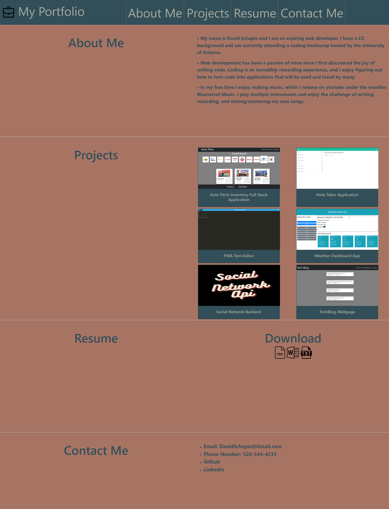

# Portfolio

## Description
A portfolio showcasing my projects and resume

## Table of Contents

- [Links](#links)
- [Example](#example)
- [Installation](#installation)
- [Usage](#usage)
- [License](#license)
- [Contributing](#contributing)
- [Tests](#tests)
- [Questions](#questions)

 ## Links
https://github.com/davidschepis/Portfolio

https://davidschepis.github.io/Portfolio/

 ## Example


 ## Installation
To install necessary dependencies, run the following command:

```
There are no dependencies
```

 ## Usage
Please use the included links if you wish to contact me

 ## License
This project is not licensed

 ## Contributing
There is no contributing to this repo

 ## Tests
To run tests, run the following command:

```
There are no tests
```

 ## Questions
Please contact me at [davidschepis@gmail.com](mailto:davidschepis@gmail.com) with any questions.
Github Repo: [davidschepis](https://github.com/davidschepis).
